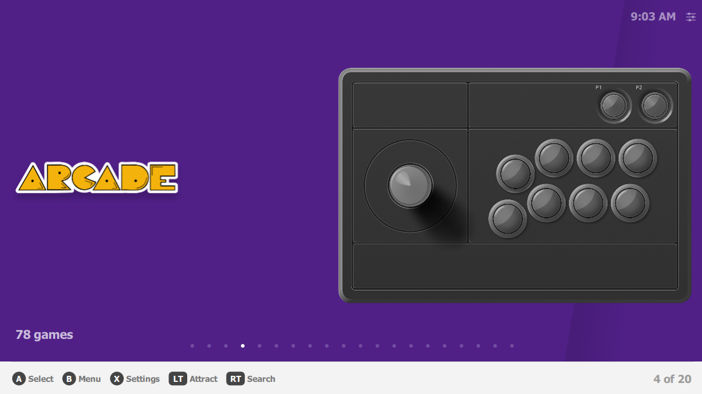
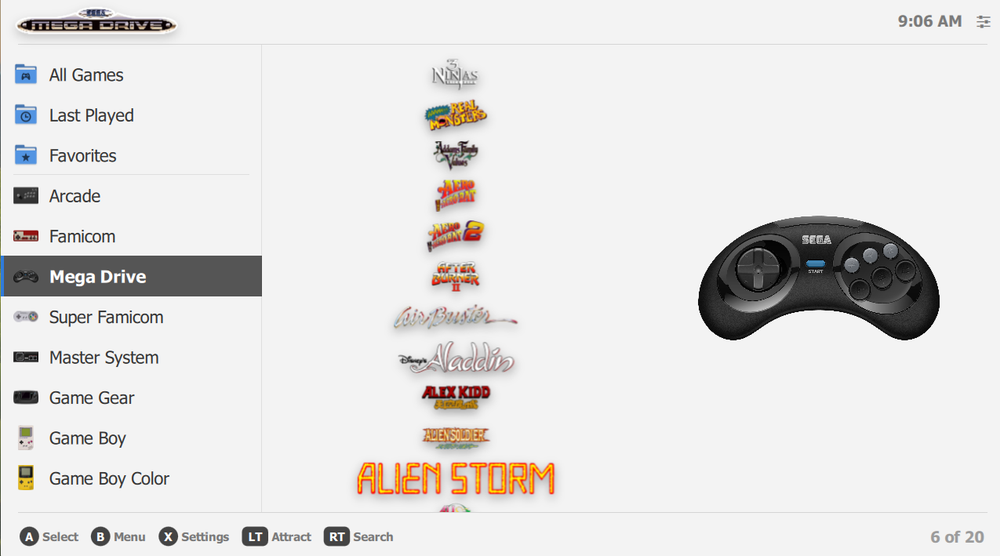
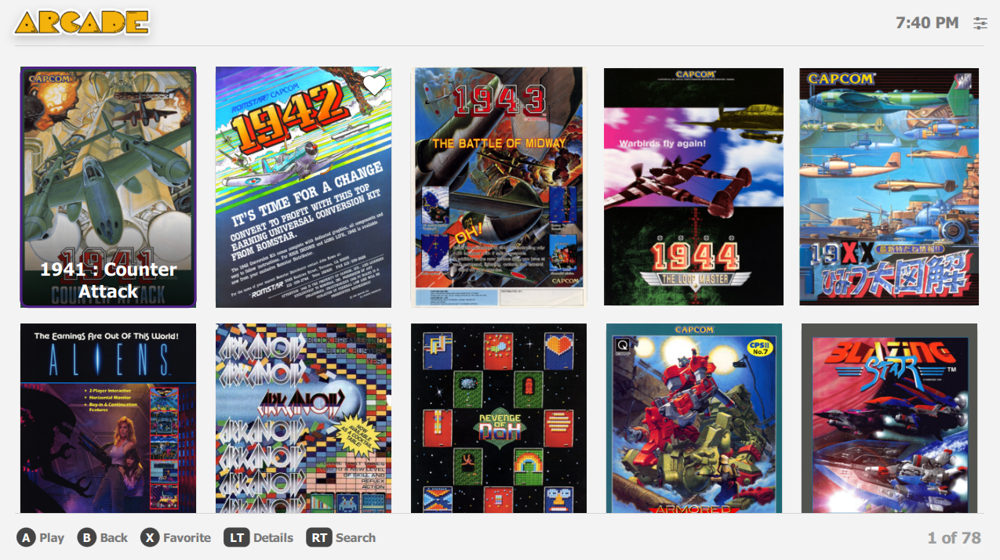
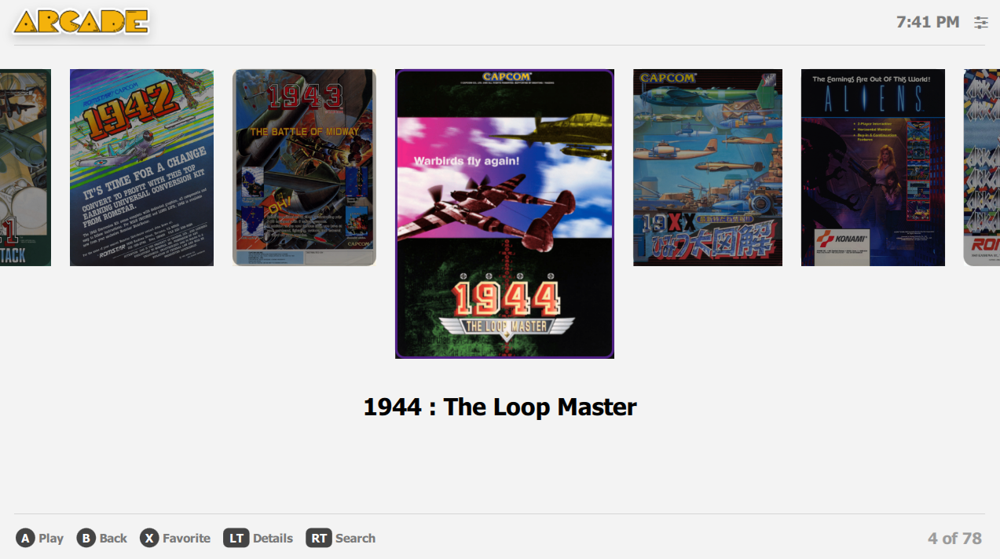
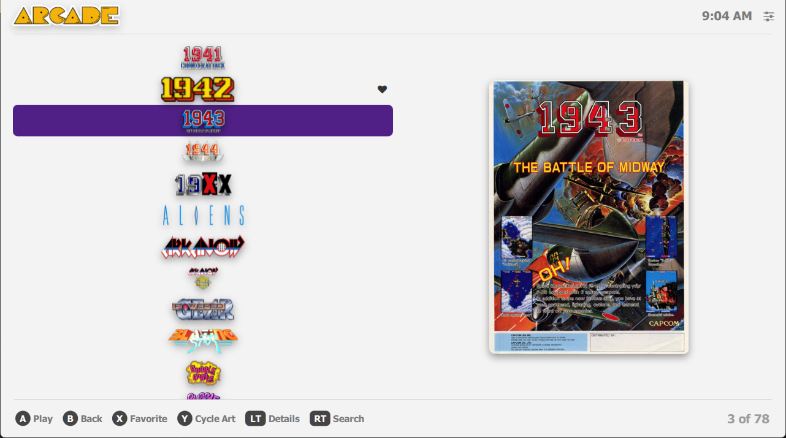
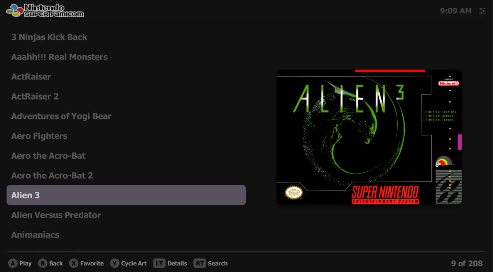
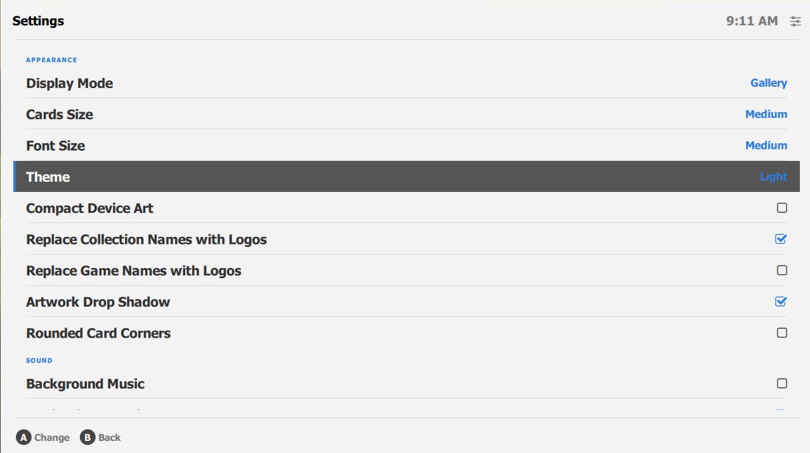

# Retro Mega Neo
[Pegasus](https://pegasus-frontend.org) theme for small and large screens.

A fork of [plaidman's RetroMega Next](https://github.com/plaidman/retromega-next), which was itself
a from-scratch rewrite of [David Fumberger's RetroMega](https://github.com/djfumberger/retromega).
This fork adds new Display Modes, platform reordering, and a round of fixes and performance work -
see [CHANGELOG.md](CHANGELOG.md).

---

## Installation and Scraping
Download the latest release and extract it into your
[theme directory](http://pegasus-frontend.org/docs/user-guide/installing-themes), in a folder of its
own. The folder name doesn't matter - Pegasus finds the theme by the `theme.cfg` inside it. You can
then select it in the settings menu of Pegasus.

The theme uses `box2dfront`,`screenshot`, `wheel` and `videos` when available.

To setup Pegasus with scraped assets, use the official written guide
[available here](https://pegasus-frontend.org/docs/) or a great video guide
[available here](https://www.youtube.com/watch?v=fGWve7YYwGQ). You can also use
[Skraper](https://www.skraper.net/) to scrape files on your
device easier.

---

## Features
- four Display Modes, switchable on the fly without a restart
    - **List** - collection carousel plus a single-column game list with a large art preview
    - **Sidebar** - console sidebar built into the game list, in place of a separate collection screen
    - **Grid** - multi-column grid of box art
    - **Gallery** - horizontal coverflow strip with the current game enlarged in the middle
- four new bundled artwork sets: full-size device art, compact device art, sidebar icons, and platform logos
- reorder your platforms however you like, from the settings screen
- optimized for handheld devices with small screens, and usable on TVs and large screens
- full controller support, with Switch or Xbox button legends
- touch support - most things in the header and footer are tappable
- search games by name
- show artwork instead of text, for both game titles and collection names
- cycle a game's preview through every scraped art type
- box art, screenshots, logos and video previews, with an optional drop shadow
- attract mode - browse random game videos and launch straight from them
- game details and metadata screen
- background music and navigation sounds
- light and dark themes, three font sizes, and three card sizes for Grid and Gallery
- All Games, Last Played and Favorites collections, each of which can be hidden
- favorites can be pinned to the top of every list
- performance options for slower devices - delayed image loading, square card corners, and shadows off

---

## Controls Guide
[CONTROLS.md](CONTROLS.md)

## Settings Guide
[SETTINGS.md](SETTINGS.md)

## Customization Options
[CUSTOMIZATION.md](CUSTOMIZATION.md)

## Version History
[CHANGELOG.md](CHANGELOG.md)

---

## Credits
- original theme and design (Retro Mega):
    - [DJFumberger](https://github.com/djfumberger/retromega)
- rewritten from scratch, and the features this fork is built on (Retro Mega Next):
    - [plaidman](https://github.com/plaidman/retromega-next)
- this fork (Retro Mega Neo):
    - [hazem-abdelghani](https://github.com/hazem-abdelghani/retromega-neo)
- device images:
    - [pineapple.graphics](https://forums.launchbox-app.com/files/file/3889-photoreal-controller-vectors-by-pineapple-graphics/)
- collection images
    - [Dan Patrick](https://forums.launchbox-app.com/files/file/3402-v2-platform-logos-professionally-redrawn-official-versions-new-bigbox-defaults/)

## License

---

## Screenshots

